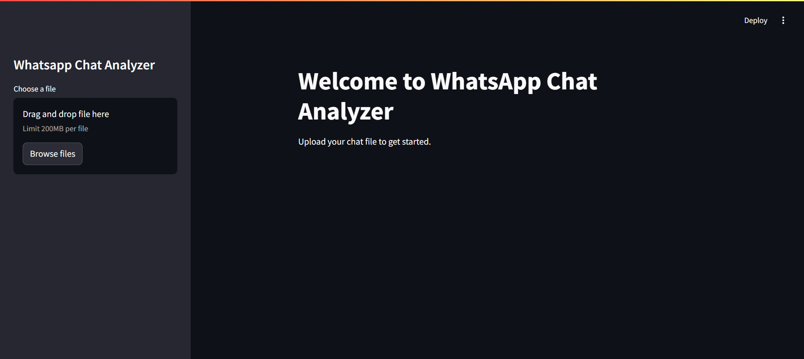
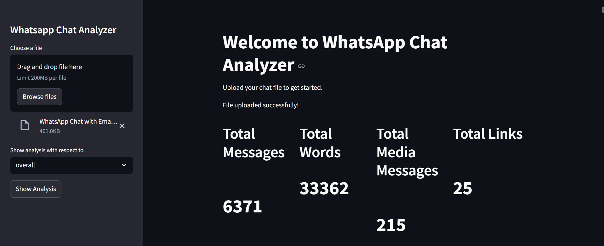
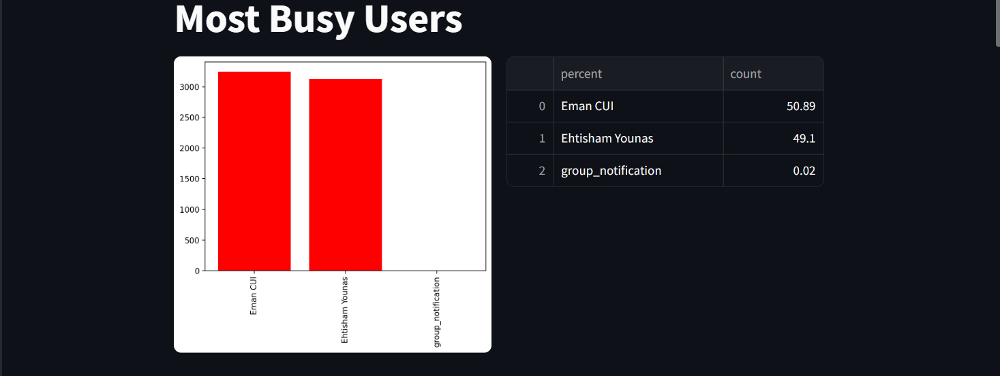
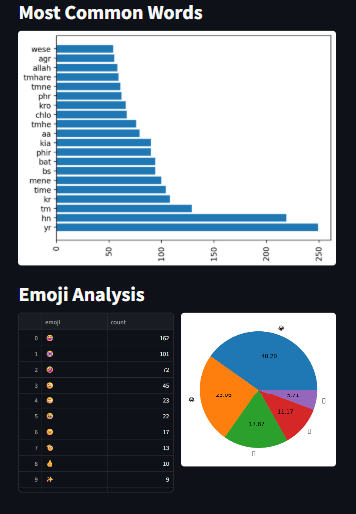

# Project Name (e.g., Project 1)

## Description
A brief description of what Project 1 does. For example, this is a web application for task management built with HTML, CSS, and JavaScript.

## Features
- Feature 1
- Feature 2
- Feature 3

## Screenshot

## Installation
1. Clone the repository: `git clone <repository-url>`
2. Navigate to the project folder: `cd project1`
3. Install dependencies (if any): `npm install` (example for Node.js projects)

## Usage
Instructions on how to run or use the project.

## Technologies Used
- List of technologies (e.g., Python, React, etc.)

## License
MIT License (or your preferred license)