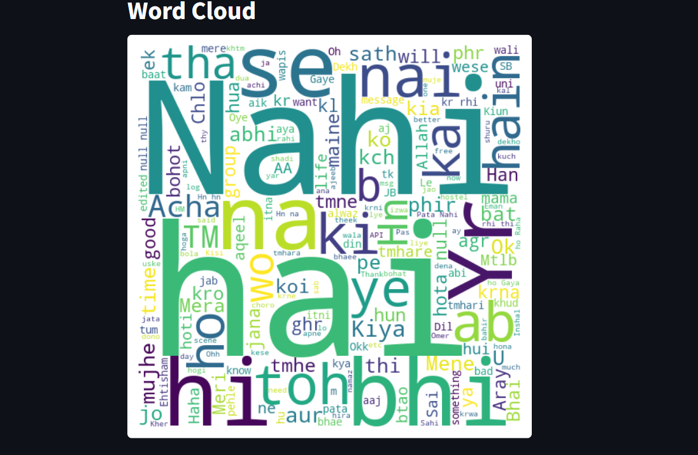

# WhatsappChatAnalyzer

## Description
A Python-based tool to analyze WhatsApp chat data, providing insights into message statistics, user activity, and conversation patterns. This project processes exported WhatsApp chat files to generate visual reports and summaries.

## Features
- Message count per user
- Most active times and days
- Word frequency analysis
- Visualizations (e.g., graphs for message trends)

## Screenshot

## Installation
1. Clone the repository: `git clone https://github.com/ehtishamexe/WhatsappChatAnalyzer.git`
2. Navigate to the project folder: `cd WhatsappChatAnalysis`
3. Install dependencies: `pip install -r requirements.txt`

## Usage
1. Export your WhatsApp chat as a `.txt` file from the WhatsApp app.
2. Place the chat file in the project folder.
3. Run the script: `streamlit run app.py`
4. View the generated analysis in the console or output files (e.g., graphs).

## Technologies Used
- Python
- Pandas
- Matplotlib
- Regular Expressions (re)
- Streamlit

## License
MIT License
